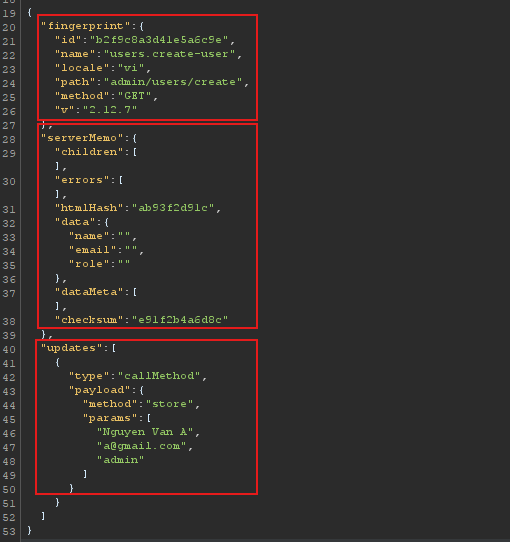
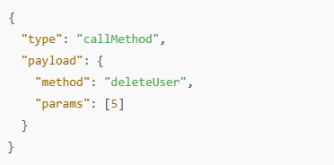
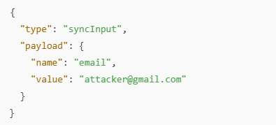
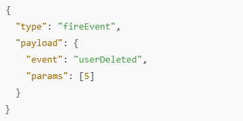
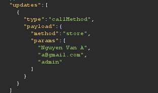
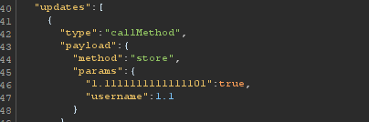
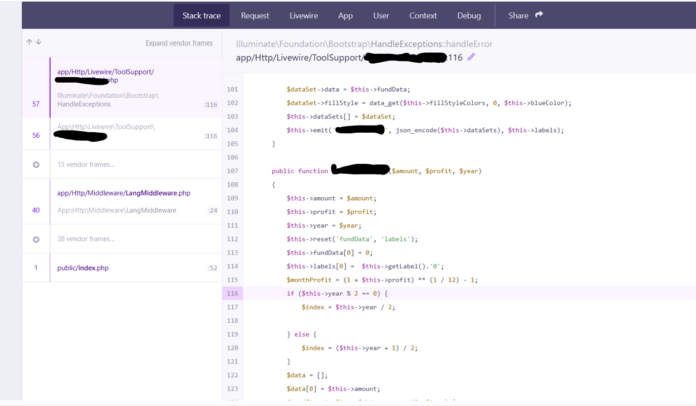

This is a trick I discovered during the testing to leak source code via LiveWire (when Laravel has debugging enabled)
This trick works by exploiting conflicts between the input and the parameters the function receives (different data types, prohibited data, ...)
Example:

- First, let's look at the fingerprint: Identify the Livewire component you're interacting with. We need to identify the component code we want to leak before attacking
- Next is the serverMemo section - a snapshot of the component's state. Think of it as containing the data you've passed to methods, variables, ..., in the current component
- These two parts cannot be manipulated due to checksums and private keys on the server
- And finally, there's the updates section - User Actions, the part we need to focus on to exploit (The data here can be manipulated and is not affected by checksums)
- I will explain the three common types in this section:
+ callMethod - The user requests the server to run a public method

--> The code is calling the deleteUser function with the input parameter 5 to delete the user with ID 5
+ syncInput - Used to update the value of a public variable

--> The code above is updating the value of the email variable to attacker@gmail.com
+ fireEvent - Client requests server to emit Livewire event

- Oki, Now we need to inject or replace valid data and parameters to allow the backend to throw errors related to data type formatting. This will enable us to read the code in that function

- For example, in the image above, instead of passing an array of strings containing user information, we would pass it as a double or JSON, ...

- The remaining task is to read the leaked source code using the Laravel debug interface

- Note: Try different data types and injections repeatedly to make the function produce a data error
